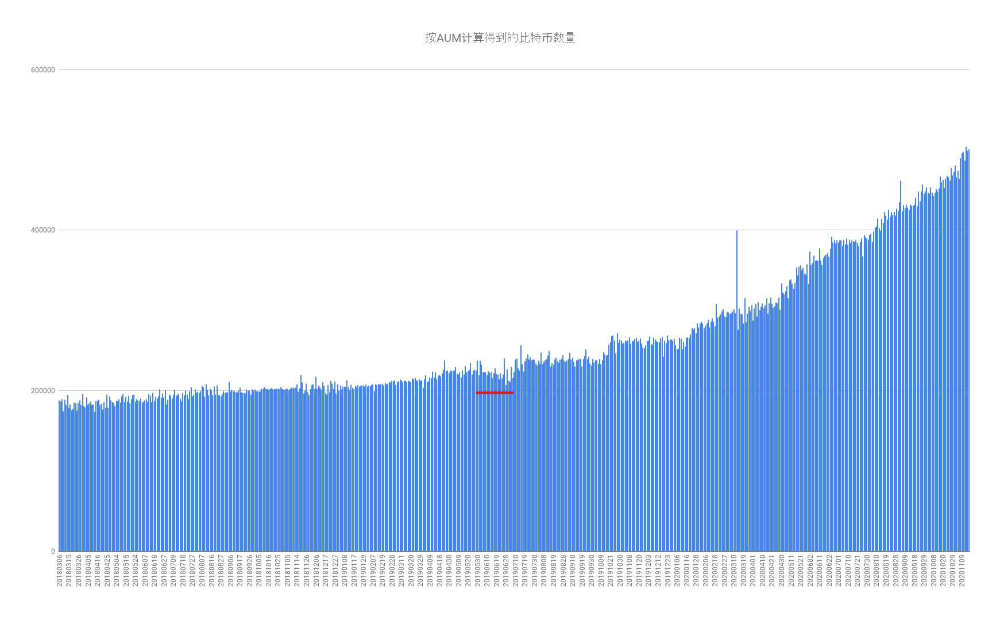
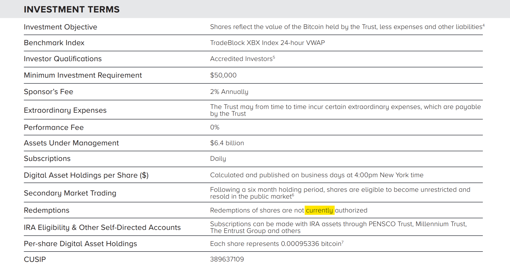

灰度官方没有持仓曲线的数据，但会在推特上以图片方式更新其管理的净资产规模（Net Assets Under Management)。从2018年3月6日至今。

所以要：

- [x] 下载所有图片
- [x] OCR
- [x] 检查数据（有无减仓）

## 下载有数据的图片图片

用谷歌浏览器在推特上搜索`from:grayscale Net Assets Under Management`，然后按“最新”。 或者直接点[这里](https://twitter.com/search?q=from%3Agrayscale%20Net%20Assets%20Under%20Management&src=typed_query&f=live)。

按F12打开开发者工具，选中“Network”，过滤出“adaptive.json”，清空网络请求记录，刷新当前页面，此时网络请求记录里就有一条请求了。右键“Copy - copy response”将记录了存在别处，这个response里有当前页面中图片的url。

向下滚动页面拿到所有数据，然后下载图片。

``` python
# 下载图片
import json
import requests
import datetime

with open('responses.txt') as f:
    for line in f:
        tweets = json.loads(line)["globalObjects"]["tweets"]
        for _, value in tweets.items():
            date = value["full_text"][0:8].split()[0]   # 11/12/20
            date_s = date.split('/')
            date = datetime.datetime(int("20"+date_s[2]), int(date_s[0]), int(date_s[1])).strftime("%Y%m%d") # 20201112
            img_url = value["entities"]["media"][0]["media_url"]
            ext = img_url.rsplit('.', 1)[1]
            filename = f"{date}.{ext}"

            print(f"{date} - {img_url}")
            print(filename)
            with open(filename, 'wb') as handle:    # download image
                    response = requests.get(img_url, stream=True)
                    if not response.ok:
                        print(response)
                    for block in response.iter_content(1024):
                        if not block:
                            break
                        handle.write(block)
```

## OCR

用[easyOCR](https://github.com/JaidedAI/EasyOCR)处理图片，得到csv。

```python
import os, re
import easyocr

def find_box(date):
    """
    不同样式的图片，目标文字的位置不同。
    样式乱七八糟的，艹。
    """
    return [(440, 510, 150, 165)] if 20181211<=date<=20181218 else\
        [(440, 510, 130, 145)] if 20191028<=date<=20191119 else\
        [(750, 870, 220, 245)] if date==20191017 else\
        \
        [(890, 1065, 105, 140)] if date<=20180329 else\
        [(925, 1080, 325, 360)] if date<=20190116 else \
        [(925, 1080, 310, 340)] if date<=20190208 else \
        [(925, 1080, 285, 315)] if date<=20190625 else \
        [(775, 900, 230, 255)] if date<=20191213 else \
        [(410, 530, 270, 300)]

reader = easyocr.Reader(['en'])
with open("aum.csv", 'a') as f:
    for entry in os.scandir('images'):
        date = entry.name.split('.')[0]
        box = find_box(int(date))
        result = reader.recognize(entry.path, box, [], detail=0, allowlist=set("0123456789.,$M"))
        aum = result[0].strip()
        # 修正部分识别错误
        aum = re.findall(r"\$(.+?)M", aum)[0]
        aum = aum.replace('.', '')
        aum = aum.replace(',', '')
        p_index = len(aum) - 1
        aum = aum[:p_index]+'.'+aum[p_index:]

        row = f"{date}\t{aum}" 
        f.write(row+"\n")
        print(f"{row}\t{box}")

```

可能还有识别错误，检查一下手动改。

## 检查数据（有无减仓）

尴尬了。

AUM（Net Assets Under Management）可能并不是比特币持仓价值。

AICoin计算的是`流通股*每股比特币量`[^1]，所得结果与AUM除以当日比特币收盘价不同。不懂为什么，但用“流通”股应该是错的。

![2020-11-19-AUM[20180306-20201118]](img/2020-11-19-AUM[20180306-20201118].png)

### 用AUM计算比特币数量

用Coinbase Pro的[API](https://docs.pro.coinbase.com/?r=1#get-historic-rates)获取20180306以来的所有日线收盘价，然后过滤出与AUM对应的，添加到之前的csv文件中。

每次最多获取300天数据，用postman手动多请求几次拼成一个数组。用下面的脚本向csv中添加收盘价。

```python
import json
from datetime import date

with open('candles.json', 'r') as f:
    candles = json.load(f)
    prices = {}
    for k in candles:
        d = date.fromtimestamp(int(k[0])).strftime("%Y%m%d")
        prices[d] = k[4]

with open('aum.csv') as f:
    aum_lines = f.readlines()
with open('aum.csv', 'w') as f:
    for line in aum_lines:
        line = line.strip('\n')
        date = line.split('\t')[0]
        price = prices[date]
        f.write(f"{line}\t{price}\n")
        print(f"{line}\t{price}")
```



**图中红线部分持仓明显下降，灰度并非不会砸。**

---

[Grayscale Bitcoin Trust Fact Sheet](https://grayscale.co/wp-content/uploads/2020/11/BTC-Trust-Fact-Sheet-November-2020.pdf) 中关于赎回规则的描述 ↓



[^1]: 用官网[这里](https://grayscale.co/bitcoin-investment-trust/#overview)的“Shares Outstanding”乘“Bitcoin per Share”。
